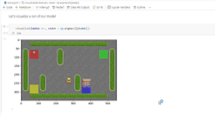

# Reinforcement learning - related training and experiments

for use with python 3.11.9

### taxi/ - solving "Taxi-v3" RL sample gym environment using Q-Learning

Jupyter notebook contains
   - implementation of policy optimization using Q-Learning method
   - visualization sample

     

more comments in the notebook itself